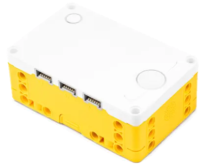
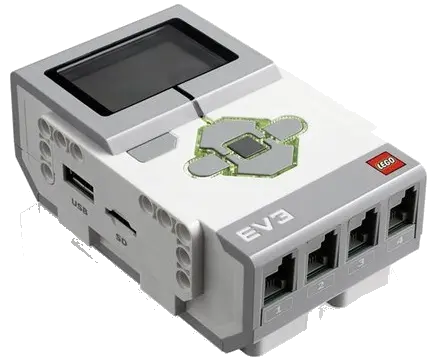

- **產品文檔**
  - [首頁](/README.md)

- **🛤️ 循線感應器**
  - **循行者 8 路 (Line8)**
    - [📖 產品介紹與校準](/sensors/line8/index.md)
    - [ SPIKE 主機](/sensors/line8/spike-hub.md)
      - [教育版 (SPIKE 3)](/sensors/line8/spike-education.md)
      - [家用版 (Robot Inventor)](/sensors/line8/spike-ri.md)
      - [pyBricks](/sensors/line8/spike-pybricks.md)
    - [ EV3 主機](/sensors/line8/ev3-hub.md)
      - [EV3 官方軟體](/sensors/line8/ev3-official.md)
      - [EV3 Classroom](/sensors/line8/ev3-classroom.md)
      - [clev3r (BASIC)](/sensors/line8/ev3-clev3r.md)
      - [pyBricks](/sensors/line8/ev3-pybricks.md)
    - [<svg viewBox="0 0 24 24" style="width:14px;height:14px;vertical-align:middle;margin-right:4px;display:inline-block;fill:none;stroke:#00d2ff;stroke-width:3;stroke-linecap:round;stroke-linejoin:round;filter:drop-shadow(0 0 2px rgba(0,210,255,0.5));"><path d="M 2,12 H 6 V 6 H 10 V 18 H 14 V 6 H 18 V 18 H 22" /></svg>通用 I2C 版本](/sensors/line8/arduino-i2c.md)
  - **循行者 16 路 (Line16)**
    - [📖 產品介紹與校準](/sensors/line16/index.md)
    - [ SPIKE 主機](/sensors/line16/spike-hub.md)
      - [教育版 (SPIKE 3)](/sensors/line16/spike-education.md)
      - [家用版 (Robot Inventor)](/sensors/line16/spike-ri.md)
      - [pyBricks](/sensors/line16/spike-pybricks.md)
    - [ EV3 主機](/sensors/line16/ev3-hub.md)
      - [EV3 官方軟體](/sensors/line16/ev3-official.md)
      - [EV3 Classroom](/sensors/line16/ev3-classroom.md)
      - [clev3r (BASIC)](/sensors/line16/ev3-clev3r.md)
      - [pyBricks](/sensors/line16/ev3-pybricks.md)
    - [<svg viewBox="0 0 24 24" style="width:14px;height:14px;vertical-align:middle;margin-right:4px;display:inline-block;fill:none;stroke:#00d2ff;stroke-width:3;stroke-linecap:round;stroke-linejoin:round;filter:drop-shadow(0 0 2px rgba(0,210,255,0.5));"><path d="M 2,12 H 6 V 6 H 10 V 18 H 14 V 6 H 18 V 18 H 22" /></svg>通用 I2C 版本](/sensors/line16/arduino-i2c.md)

- **📡 雷射測距**
  - **測距者 2 路 (TOF2)**
    - [📖 產品介紹](/sensors/tof2/index.md)
  - **測距者 8 路 (TOF8)**
    - [📖 產品介紹](/sensors/tof8/index.md)

- **🎮 遙控接收器**
  - **掌控者 PS2 (PS2)**
    - [📖 產品介紹](/sensors/ps2/index.md)
  - **掌控者 PS4 (PS4)**
    - [📖 產品介紹](/sensors/ps4/index.md)

- **👁️ 機器人視覺**
  - **神攝手 ESP32CAM (ESP32CAM)**
    - [📖 產品介紹](/sensors/esp32cam/index.md)

- **🔌 擴充模組**
  - **SPIKE 6 路擴充器 (EXT6)**
    - [📖 產品介紹](/sensors/ext6/index.md)
